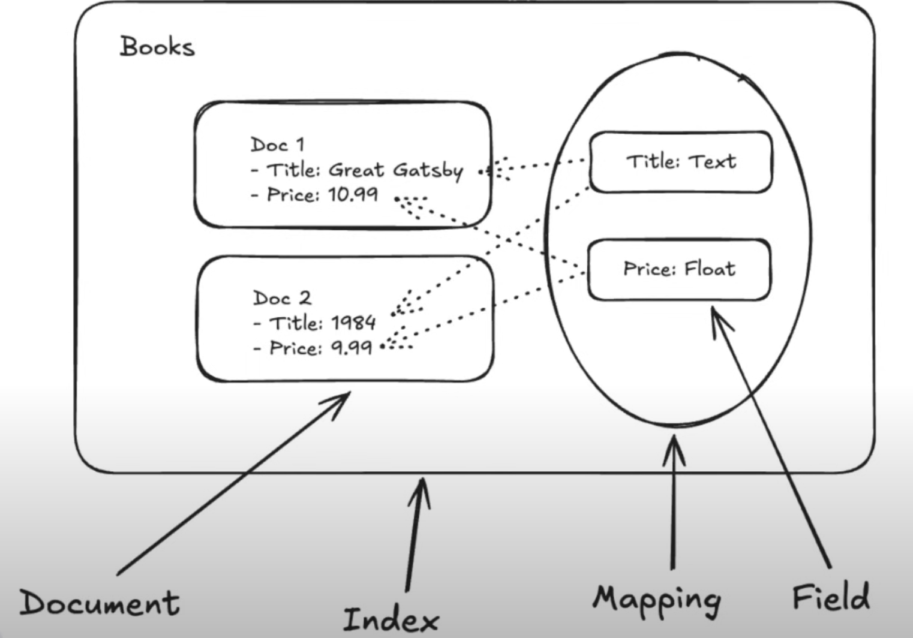
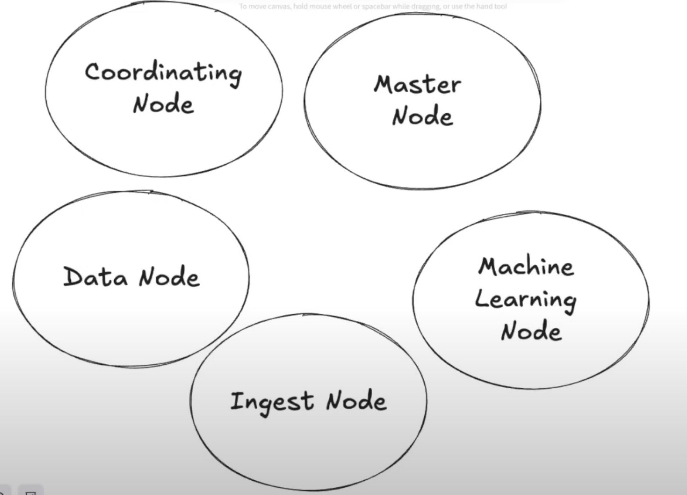
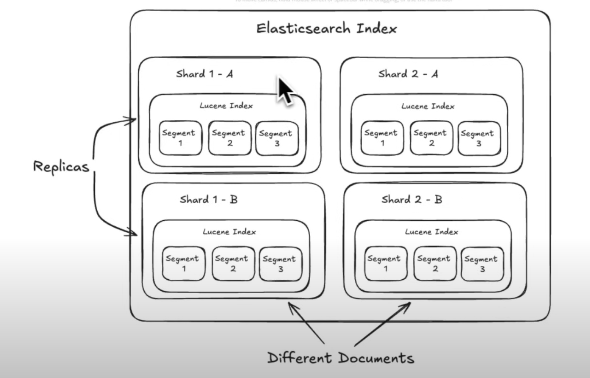
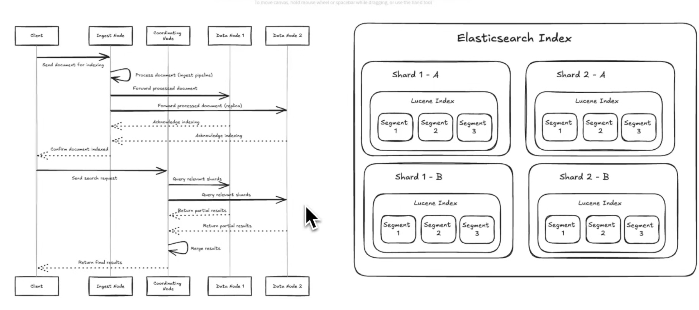

# Elasticsearch Deep Drive

- https://www.youtube.com/watch?v=PuZvF2EyfBM
- https://www.hellointerview.com/learn/system-design/deep-dives/elasticsearch

- In elasticsearch, an `index` is just a collection of documents that we want to make searchable
    - Think of an index as a database table
- A `mapping` specifies the schema that we want to be searchable on the documents
    - May have dozens of fields, but maybe the users only search by a few
- From an interview perspective, having information about Elastic from a client perspective may suffice
    - Think about twitter, searching isn't the main goal of the system, so having elasticsearch in there may be good but doesn't need to be covered in depth
    - If you're implementing something that covers some core concepts that elastic also uses or you're designing something that seems like elasticsearch, then knowing how elastic works under the covers is important

- Can have elastic dynamically determine mapping (overhead doing this, probably not best for prod) or specify it manually
- Example of a mapping
    - In the below, `text` allows full text search on the field
    - `keyword` means that there are some selections that the user can probably make in the UI, you can't do a full text search
    - Having these `nested` reviews means that we can search on this properties as well - can construct queries where we want books with certain types of reviews
        - If queries rarely touch reviews or if reviews are constantly updated, this probably isn't a great design - this assumes that customers care a lot about reviews but reviews aren't changing all that much

## Inserting Data

## Updating Data

- What happens if you and someone else both make an update at the same time
- Passing the version (like in upper right hand corner) allows elastic to tell you that you weren't updating the latest version and you can handle that (elastic rejects update)
    - *You don't have to do this if you don't want to, if you don't last update wins*
- Bottom right shows field by field update if you want to do it that way

 

 ## Searching 

 

 - Searching with sorting
    - Elastic has way you can specify scripts with `painless`

 

 ## Search Results

 - `_score` tries to match relevant match between search criteria and results

 

## Pagination

- Stateful pagination, requires server to keep track of cursor so can continue returning the results - left part of screenshot
    - Fine for small number of docs
- Stateless pagination - right part of screenshot
    - Pass in some parameter to localize where in a result set we'd like to look
    - Better for larger set of documents
        - Pass in values of the last results as the starting point for the last page

### Cursors

- Index is constantly changing and documents moving around within index
    - Imagine doc moved to a page that you already looked through
    - Elasticsearch handles this with a point in time query
        - This can be expensive
    - `Point in Time` - uses cursors and creates lot more overhead

## Important Notes

- Not primary database
    - Durability and availability aren't great
    - Use CDC with primary database to push changes into elastic
- Best with read-heavy workloads
    - Performs best when reading a lot of data
- Must tolerate eventual consistency
    - Has delayed version of data
- Denormalization is key
    - Flatten data, don't make nested relational queries - joins aren't supported (doing in app joins isn't a good idea)
- Do you need it
    - Complex to maintain and run
    - Search in existing database may suffice

## Elastic deep dive

- Built on top of Lucene
- Lucene has a main goal of making sure data is organized and searching is fast
- Elasticsearch is like an orchestration layer on top of Apache Lucene - handles the distributed systems aspects 

### Clusters in ElasticSearch Cluster 

- Note, even though these are separate, you can have multiple nodes run on a single server
- node != physical machine
- These are the responsiblities that exist within a cluster
- Master node
    - Only 1 at any given time
    - Only node that can perform cluster-level operations like adding or removing nodes
    - Think of it like an `admin`
- Coordinating node
    - API interface to cluster
    - Parses request and passes requests to nodes that have data
    - Coordinates search requests across cluster
- Data nodes
    - Where we keep documents
    - Heavy I/O
- Ingest nodes
    - How documents made way into nodes
- ML nodes
    - ML intensive tasks
    - Different access patterns, may need GPU
- Different hardware for different nodes
    - Master nodes very reliable - don't go down
    - Coordinating node, lots of traffic from outside workloads
    - ...
    - Ingest Nodes, analysis of documents
    - Different types of VMs to optimize cluster
    - Can have a single machine be multiple types if needed

### Indices

- Replicas are copy of shards
    - Spread load
    - Gain throughput for reads
    - Increase availability
- Shards hold the documents and build up indexed data structures to make searching fast
    - A document is assigned to one shard or another
    - 2 billion documents
- A shard is encapsulating a lucene index
    - Inside of a lucene index there are segments
    - A segment contains multiple documents
    - Segments are deleted
    - An update is actually a soft delete
        - Marked as delete in one segment and a new document created in another segment

### Inside a Lucene Index

- Searching segments is important
- One of the ways this happens is an inverted index
- How can you making looking up data fast?
    - 2 major ways
        - 1 is organizing data - think hashmap for O(1) time
        - 2 is making copies of data
            - If we can make a copy of our data and store it in a slightly different way, we may be able to look it up faster
                - Storage tradeoff
            - Just making the copy so we can arrange the data how we want
- Inverted index makes both tradeoffs
    - Dictionary stored of words in documents to identifiers of each document
        - Lazy is in documents 12 and 53
        - What words to index, maybe you don't want to index the word "are" or maybe there are different spellings of the word "dog" that we want to combine together

- Search queries may have sort order, maybe want to sort by price
- How to organize table of information
    - 2 ways
        - 1 like SQL databases - table is like array of rows
            - Easy to get entirety of row given identifier

- With Lucene maybe we want just the prices, and we can do that by making columns
    - Can grab all of the prices without crawling over the entire table and looking at each row
    - In Lucene this is an index called `doc values`

- Query planning
- Lot of different options that give the same results but that are faster or slower

#### Lucene Segment CRUD

- Lucene indexes are made up of `segments` 
- **Immutable** containers of indexed data
    - When we insert a document, we don't immediately store it in the index - we add it to a segment
        - When we have a batch of documents, we construct the segment and flush it out to disk
- When segments get too big, we can merge them
- For deletions, each segment has a set of deleted identifiers
    - When a segment is queried for data against a delete document, it pretends it doesn't exist - but the data is still there
    - During merge operations, the merged segments clean up deleted documents
- For updates, we don't actually update the segment
    - We *soft* delete the old document and insert a new document with updated data
    - The old document gets cleaned up on segment merge events later 
        - This makes deletions fast but has some performance penalties until we merge and clean up those segments (ideally not a lot)
    - Updates actually have worse performance than insertions because we need to handle the bookkeeping of soft deletions
        - *This is part of why Elasticsearch isn't a great fit for data that is rapidly updating*

 

##### Benefits of Immutable Architecture

- Improved write performance
    - New documents can be quickly added to new segments w/o modifying existing ones
- Efficient caching
    - Since segments are immutable, they can be cached in memory or SSD w/o worrying about consistency issues
- Simplified concurrency
    - Read operations don't need to worry about data changing mid-query, simplifying concurrency access
- Easier recovery
     - In case of crash, easier to recover from immutable segments as their state is known and consistent
- Faster searches
    - Immutable nature allows for optimized data structures and algorithms for searching

### Sequence Diagrams

## In Your Interview

- Elasticsearch is usually hooked up to some other primary DB using CDC